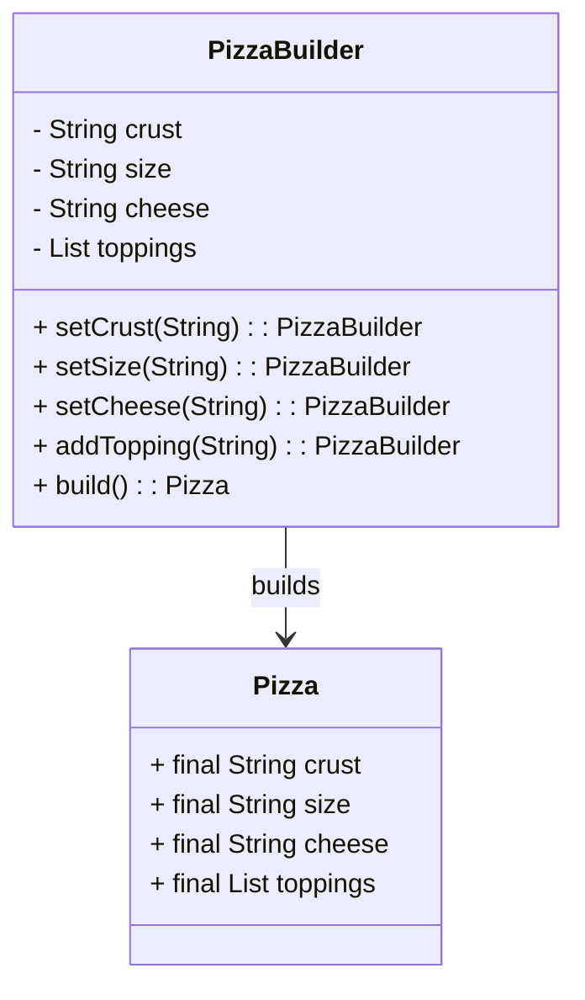

## Pizza Builder (Java)

A  Java project demonstrating the **Builder pattern** to create immutable pizzas with  defaults and input validation.

### Requirements
- Java 24+
- Maven 3.6+

### Clone Repository
```bash
git clone https://github.com/neverthesameagain/PizzaBuilder-SWE-2025
cd pizza-builder
```
```bash
mvn clean compile
````
```bash
mvn checkstyle:check
````
```bash
mvn clean test
````

### Builder Pattern
Creating a pizza has several optional attributes. The Builder pattern lets us set only what we need, step by step, and then build a single immutable result.


- **`PizzaBuilder` (Builder)**  
  - Stores mutable configuration (crust, size, cheese, toppings).  
  - Validates inputs (non-null, non-blank, trims whitespace).  
  - Creates the final object via `build()`.  

- **`Pizza` (Product)**  
  - Immutable data class with `final` fields.  
  - Constructor is package-private to enforce creation through the builder.  
  - Provides an unmodifiable toppings list to maintain immutability.  

### Usage

```java
Pizza pizza = new PizzaBuilder()
    .setCrust("Thick")
    .setSize("Large")
    .setCheese("Cheddar")
    .addTopping("Pepperoni")
    .build();

System.out.println(pizza);
```

### UML Diagram




### Defaults

* Crust: `Thin`
* Size: `Medium`
* Cheese: `Mozzarella`
* Toppings: none

### Run Checkstyle + Tests

```bash
mvn clean verify
```

